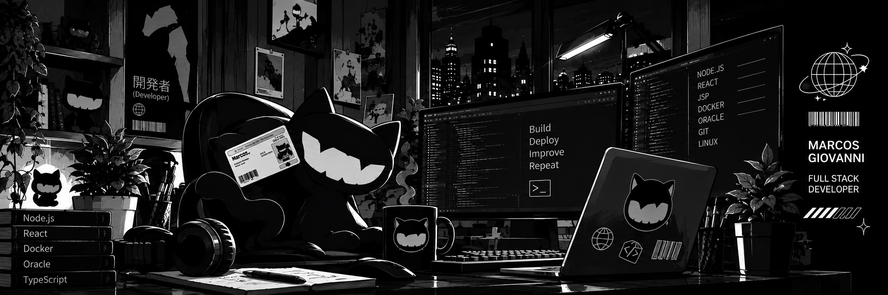

Marcos Giovanni

Full Stack Developer · Web Applications · APIs · Systems

About Me

I'm a Full Stack Developer building, maintaining and shipping internal web applications and custom solutions.

I work across the stack with React, TypeScript, Node.js, databases and APIs, with hands-on experience in deployments, troubleshooting and corporate technical support.

My focus is simple: understand the problem, build the right solution, keep it maintainable, and make sure it works reliably in production.

Problem-solving · Continuous improvement · Reliable software

What I Do

🧩 Build and maintain corporate web applications and internal systems

⚛️ Develop modern interfaces with React, TypeScript and JavaScript

🟢 Build backend services and integrations with Node.js

🔌 Design and consume REST APIs and third-party integrations

🗄️ Work with relational and NoSQL databases

🐳 Containerize and deploy applications with Docker

🛠️ Troubleshoot production issues and investigate technical problems

🔄 Maintain and modernize existing applications, including legacy systems

🚀 Take features from development to deployment and maintenance

Tech Stack

Frontend

Backend & APIs

Databases & Infrastructure

Tools

Selected Projects

🏢 Corporate & Web Applications

Projects involving corporate websites, internal systems, integrations and business applications.

Site Consórcio Fancar — web application and business-focused digital experience

Site Fancar Seguros — corporate insurance platform

Site Vagas Fancar — recruitment and job application platform

Mitsubishi / Honda / Ford projects — institutional and campaign-oriented web applications

FAQ Central de Dúvidas — internal knowledge and support solution

🧪 Personal & Experimental Projects

I also use side projects to explore new technologies, architectures and product ideas — from developer tooling to SaaS concepts and automation.

Engineering Mindset

Understand the problem
        ↓
Design the solution
        ↓
Build
        ↓
Test & troubleshoot
        ↓
Deploy
        ↓
Monitor & improve
        ↺

I care about software that is not only functional, but also understandable, maintainable and dependable.

GitHub Activity

Currently

Building        → scalable web applications
Working with   → React · TypeScript · Node.js
Connecting     → APIs · databases · corporate systems
Improving      → architecture · reliability · developer experience
Learning       → new technologies and better ways to solve problems

Let's Connect

If you're working on a web application, internal platform, API, integration or software product, feel free to connect.

Build · Deploy · Improve · Repeat

