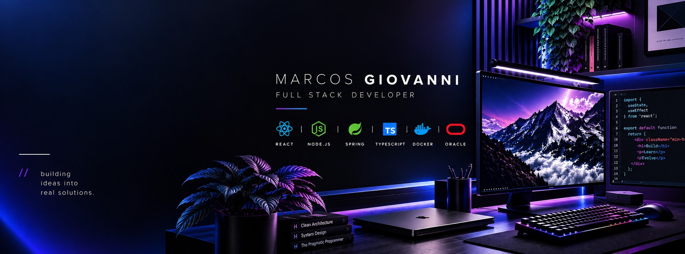
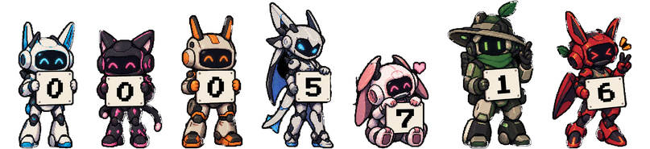

<div align="center">

[](#about)&nbsp;
[](#building)&nbsp;
[](#stack)&nbsp;
[](#projects)&nbsp;
[](#stats)



<a href="https://github.com/1a8jkf">
  
</a>

[](https://www.linkedin.com/in/marcos-giovanni-24768537b/)
[](https://www.instagram.com/marcos_lachousrisky01)
[](mailto:MarcosAllmeida167@gmail.com)
[](https://workspacejobs.com.br)
[](https://github.com/1a8jkf)

<br/>



</div>

<br/>

## about

Full Stack Developer building, maintaining and shipping internal web applications and custom solutions.
Works with React, TypeScript, Node.js, databases and APIs, with hands-on experience in deployments, troubleshooting and corporate technical support.
Focused on problem-solving, continuous improvement and delivering solutions that are functional and reliable.

```js
const marcos = {
  role: "Full Stack Developer",
  focus: [
    "internal web applications",
    "APIs and databases",
    "deployments and troubleshooting",
    "systems programming in Rust",
  ],
  stack: ["TypeScript", "React", "Node.js", "PostgreSQL", "Rust"],
  principle: "functional, reliable, always improving",
  status: "open to opportunities and collaborations",
};
```

<br/>

## building

<div align="center">

[](https://github.com/1a8jkf/ferrum-alloc)
[](https://github.com/1a8jkf/ferrum-injector)
[](https://github.com/1a8jkf/universal-resilience-toolkit)
[](https://github.com/1a8jkf/devflux)
[](https://github.com/1a8jkf/cep-api)

</div>

<br/>

## stack

<div align="center">

**Languages**


**Frontend**


**Backend & Data**


**Infra & Tools**


</div>

<br/>

## projects

<table>
  <tr>
    <td width="50%" valign="top">
      &nbsp;
      <b><a href="https://github.com/1a8jkf/ferrum-alloc">ferrum-alloc</a></b> · Memory<br/><br/>
      High-performance O(1) memory allocator written in Rust.<br/>
      
    </td>
    <td width="50%" valign="top">
      &nbsp;
      <b><a href="https://github.com/1a8jkf/ferrum-injector">ferrum-injector</a></b> · Windows<br/><br/>
      DLL injector for FerrumAlloc on Windows, also in Rust.<br/>
      
    </td>
  </tr>
  <tr>
    <td width="50%" valign="top">
      &nbsp;
      <b><a href="https://github.com/1a8jkf/universal-resilience-toolkit">universal-resilience-toolkit</a></b> · Runtime-agnostic<br/><br/>
      Composable retries, rate limits and circuit breakers for Node, Bun, Deno, Workers and Vercel Edge.<br/>
      
    </td>
    <td width="50%" valign="top">
      &nbsp;
      <b><a href="https://github.com/1a8jkf/devflux">devflux</a></b> · Mobile dev<br/><br/>
      Native Alpine Linux shell for Android to run and sync Node.js projects from a phone.<br/>
      
      
    </td>
  </tr>
  <tr>
    <td colspan="2" valign="top">
      &nbsp;
      <b><a href="https://github.com/1a8jkf/cep-api">cep-api</a></b> · Node.js<br/><br/>
      Brazilian postal code (CEP) lookup API with JWT auth and in-memory cache.<br/>
      
    </td>
  </tr>
</table>

<div align="center">

Also built client sites and landing pages for Fancar, Mitsubishi, Honda and Ford.
[See all repositories](https://github.com/1a8jkf?tab=repositories)

</div>

<br/>

## stats

<div align="center">



<br/><br/>

<!--
  Live bot visitor counter — swap in once your custom "bots" theme is hosted (see counter/SETUP.md).
  Replace YOUR-COUNTER-HOST with your domain, then remove the comment markers and delete the static banner above.


<br/><br/>
-->


</div>

<br/>

<div align="center">



</div>
